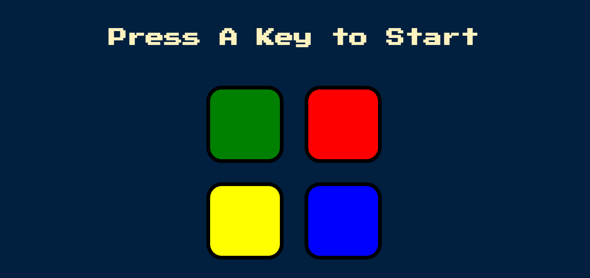

# Simon Game

[Click here to access the game](https://raedevbr.github.io/simon-game/)

## How the game works:  
1. Press any key on the keyboard for start the game
2. After the game has started, a random color will be chosen automatically
3. Click on this same color that was chosen automatically and you'll pass for level 2
4. Now the game will choose another random color
5. This process will be repeated at each level and you will need to memorize and click on the sequence of colors that were chosen randomly
6. If you lose, press any key to restart the game and try again

This is a game to test the power of your memory!

*Hope you enjoy it* 🙃
*Feel free to open an issue and contribute with the project* ❤️ 

